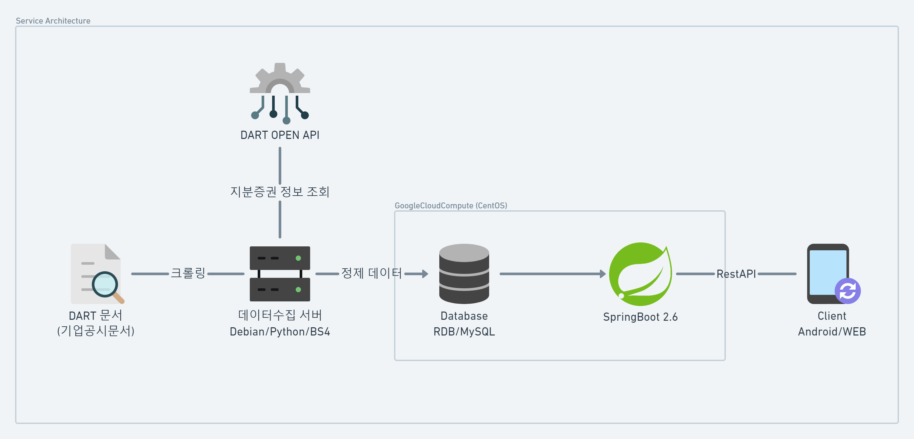
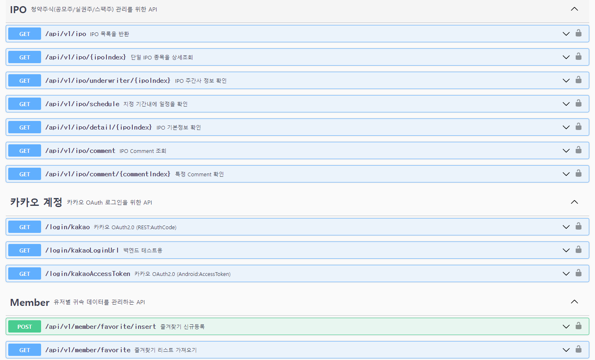

# 공모주토피아 백엔드 서버 개발

## 📙 프로젝트 개요
### 프로젝트 설명
- 공모주(IPO) 관련 법이 개정되면서 일반 개인들에게도 매력적인 투자수단이 되었습니다.
- 하지만 이를 안내해주는 마땅한 서비스가 없어 해당 서비스를 개발하게되었습니다.
- 크롤링된 공모주 정보를 Client에게 Restful API로 전달 및 관리
- 공모주 관련 플랫폼을 구축하는 것이 목표인 백엔드 프로젝트

 

### 💻 담당 업무

**SpringBoot Backend 개발** (해당 repo.)

- 담당 인원 : 1인
- Spring API
  - Spring: `SpringBoot2`, `Gradle`, `IntelliJ`, `Java8`, `lombok`
  - DB: `Mybatis`, `Hikari`
  - API Document: `Swagger 2.9.2`
  - etc: `AOP (Transaction, LoggerAspect)`, `WebClient (HttpConnection)`
- Database: `MariaDB`
- ServerComputer: `Google Compute Engine`, `CentOS Linux release 8.4.2105`
- dev Tool: `HeidiSQL DataGrip`, `putty winscp`, `Postman Swagger-UI`

**공모주 데이터 크롤링**

- 담당 인원 : 3인
- 크롤러: `Python3.9`, `BS4`, `PyMysql`

 

### 📆 개발 기간
- 2021.11 ~ 2022.10 (진행중)

   

## 🛠 프로젝트 상세 정보
### 🎆 서비스 아키텍처
해당 문서에서는 아래 그림의 `SpringBoot` 에 대해 다룹니다.

 

### 🤔 주요 기능
- IPO: URL 요청을 통해 공모주, 실권주, 스펙주에 청약관련 정보를 확인할 수 있습니다.
- Underwriter: 청약을 진행하는 주간사 정보와 최대 청약 개수를 확인할 수 있습니다.
- Schedule: 지정된 기간에 청약 일정이 있었는지 확인할 수 있습니다. (예. 오늘, 이번주, 지난달 등)
- Comment: 각 종목에 정보가 변화된 기록을 확인할 수 있습니다.
- SwaggerLink : http://server.dbsg.co.kr:8080/swagger-ui/index.html

 

### 📺 연동되는 Client
- 아래 링크를 통해 서버API로부터 데이터를 받아 제공하는 Android App 정보를 확인할 수 있습니다. 
- https://github.com/psw9999/Gongmozootopia

<!--
### 고민한점

### 배운점
-->

