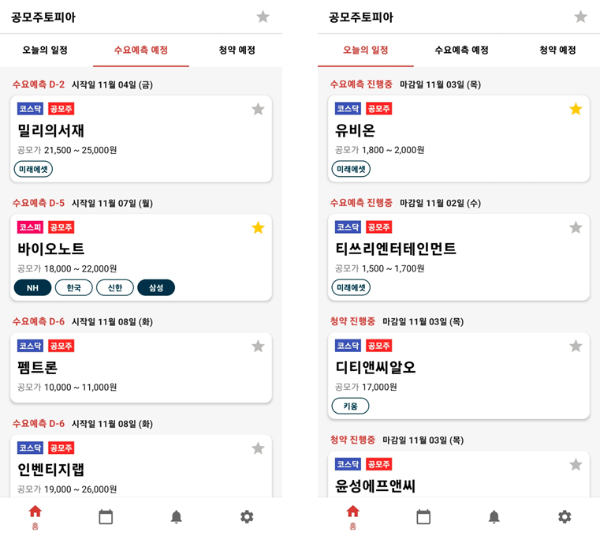

# 공모주토피아 백엔드 서버 개발

## 📙 프로젝트 개요
### 프로젝트 설명
- 주식 시장 신규상장(IPO) 정보를 알려주는 서비스
    - 공모주 관련 플랫폼을 구축하는 것이 목표인 백엔드 프로젝트
- 크롤링된 공모주 정보를 Client에게 Restful API로 전달 및 관리
    - 전자공시시스템(DART) 데이터를 직접 크롤링/가공 하여 사용
- SpringBoot, MySQL, Mybatis, OAuth2.0(카카오), REST 규격을 이용한 백엔드 담당
- 안드로이드로 서비스 중 : [PlayStore](https://play.google.com/store/apps/details?id=com.psw9999.gongmozootopia.prod.release)

**배경**
- 공모주(IPO) 관련 법이 개정되면서 일반 개인들에게도 매력적인 투자수단이 되었습니다.
- 하지만 이를 안내해주는 마땅한 서비스가 없어 해당 서비스를 개발하게되었습니다.

 

### 💻 담당 업무

**SpringBoot Backend 개발** (해당 repo.)

- 담당 인원 : 1인
- Spring API
  - Spring: `SpringBoot2.6.4`, `Gradle`, `Java8`, `lombok`
  - Security: `security`, `jjwt`
  - DB: `Mybatis`, `Hikari`
  - API Document: `springdoc-openapi-ui(Swagger)`
  - etc: `AOP (Transaction, LoggerAspect)`, `WebClient(webFlux)`
- Database: `MariaDB`
- ServerComputer: `Google Compute Engine`, `CentOS Linux release 8.4.2105`
- dev Tool: `HeidiSQL DataGrip`, `putty winscp`, `Postman Swagger-UI`

**공모주 데이터 크롤링**

- 담당 인원 : 3인
- 크롤러: `Python3.7`, `BS4`, `PyMysql`
- `Linux`, `Debian`, `crontab`

 

   

## 🛠 프로젝트 상세 정보
### 🎆 서비스 아키텍처
해당 문서에서는 아래 그림의 `SpringBoot` 에 대해 다룹니다.

 

### 🤔 주요 기능
- IPO: URL 요청을 통해 공모주, 실권주, 스펙주에 청약관련 정보를 확인할 수 있습니다.
  - Underwriter: 청약을 진행하는 주간사 정보와 최대 청약 개수를 확인할 수 있습니다.
  - Schedule: 지정된 기간에 청약 일정이 있었는지 확인할 수 있습니다. (예. 오늘, 이번주, 지난달 등)
  - Comment: 각 종목에 정보가 변화된 기록을 확인할 수 있습니다.
- AUTH: 카카오 OAuth2.0로 로그인 및 신규가입합니다. 
  - 추후 개인별 즐겨찾기, 보유 증권사 목록 등의 정보를 서버에서 관리하여 플랫폼간 연결성을 높일 예정입니다.
- SwaggerLink : http://server.dbsg.co.kr:8080/swagger-ui/index.html

 

### 📺 Client App
- 아래 링크를 통해 서버API로부터 데이터를 받아 제공하는 Android App 정보를 확인할 수 있습니다. 
- https://github.com/psw9999/Gongmozootopia

<!--
### 고민한점

### 배운점
-->

